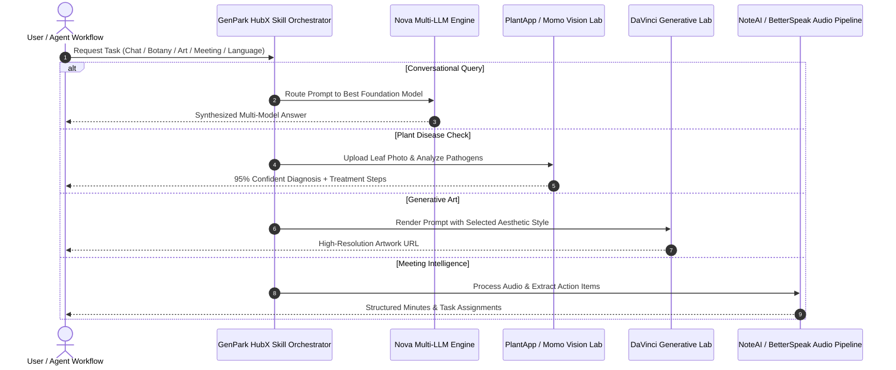

# genpark-hubx-ai-apps-orchestration-skill

   

> **GenPark AI Agent Skill** -- HubX intelligent AI apps portfolio, multi-model AI chatbot orchestration, vision diagnostics & generative tools.

[HubX](https://hubx.co/products) builds, invests in, and publishes cutting-edge mobile apps loved by over 200 million users worldwide. This agent skill orchestrates HubX's core AI products into a unified programmatic interface for autonomous agents, conversational assistants, and workflows.

---

## 🌟 Distilled HubX Products Suite

| Product | Focus Area | Key Capability |
| :--- | :--- | :--- |
| **Nova** | Multi-Model AI Chatbot | Combines leading text LLMs, speech-to-text, translation, and cross-device sync |
| **PlantApp** | Botany Vision & Diagnostics | Identifies 100,000+ plants daily with 95% accuracy and treatment recommendations |
| **DaVinci** | AI Art & Image Generation | State-of-the-art text-to-image synthesis, style transfer, and creator gallery |
| **NoteAI** | Meeting Intelligence | Automated audio recording, executive summaries, and action-item extraction |
| **BetterSpeak** | AI Language Tutor | Real-time conversational practice with interactive AI avatars and pronunciation scoring |
| **Momo** | AI Portraits & Avatars | Ultra-realistic photo generation for professional headshots and creative portraits |
| **HomeAI** | Architectural Design | AI-powered interior, exterior, concept, and landscape rendering |
| **Lean** | Nutrition & Macro Tracker | Photo and barcode food logging with smart calorie and dietary adjustments |

---

## 📊 Architecture Workflow



---

## 🚀 Quick Start

### 1. Test All 5 HubX Capabilities
```bash
python example_usage.py
```

### 2. Model Context Protocol (MCP) Server
```bash
python mcp_server.py
```

---

## 📄 License
MIT License. Published by GenPark AI.
