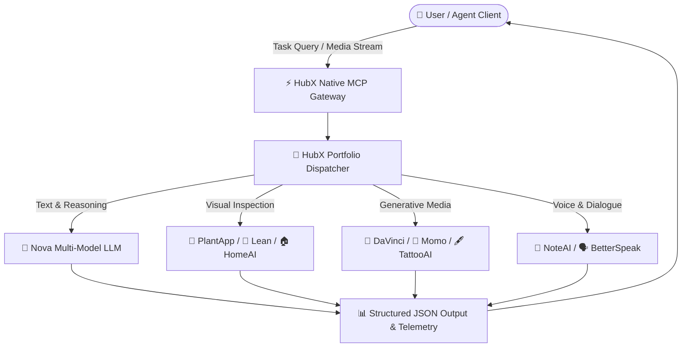

# genpark-hubx-ai-apps-orchestration-skill

<div align="center">

[](https://www.python.org/)
[](LICENSE)
[](https://genpark.ai/mcp)
[](https://genpark.ai)
[-brightgreen.svg?style=for-the-badge)](requirements.txt)

<p align="center">
  <b>Production-Grade HubX AI Portfolio & Mobile Multimodal Agent Skill</b> • <b>100% Standard Library Python</b> • <b>Native Model Context Protocol (MCP)</b>
</p>

[🌐 GenPark MCP Hub](https://genpark.ai/mcp) • [📦 HubX Official Products](https://hubx.co/products) • [📖 Documentation](#quickstart)

</div>

---

## 📌 Overview & Capability

**genpark-hubx-ai-apps-orchestration-skill** is a deterministic, zero-dependency Python skill and native Model Context Protocol (MCP) server engineered for autonomous personal and mobile agents. Distilled directly from **HubX** ([hubx.co/products](https://hubx.co/products)), it provides unified agentic orchestration and tool execution across HubX's global mobile AI portfolio:

* 🤖 **Nova**: All-in-One Multi-LLM Chatbot & AI Assistant (200M+ users).
* 🌱 **PlantApp**: Computer Vision Plant Identification & Botanical Disease Diagnostic.
* 🎨 **DaVinci**: Generative Text-to-Art, Image-to-Image & Creator Feed.
* 🖋️ **TattooAI**: AI Tattoo Design, AR Try-On & Cover-Up Synthesis.
* 📸 **Momo**: Photorealistic Portrait & Headshot Generator.
* 🏠 **HomeAI**: AI Interior, Exterior & Architectural Spatial Restyling.
* 🥗 **Lean**: Vision-Based Macro, Calorie & Nutrition Tracker.
* 📝 **NoteAI**: Meeting Audio Transcription, Summary & Action Item Extraction.
* 🗣️ **BetterSpeak**: Interactive Conversational AI Language Tutor with Live Avatars.
* 🧘 **Lotus Flow**: Mindful Movement, Yoga & Wellness Workflow Orchestrator.

> **Executive Capability**: GenPark AI Agent Skill - HubX intelligent AI apps portfolio, multi-model chatbot orchestration, vision diagnostics & generative tools distilled from hubx.co/products.

---

## 🏗️ Architecture & Orchestration Flow


```mermaid
graph TD
    User([👤 User / Agent Client]) -->|Task Query / Media Stream| MCP[⚡ HubX Native MCP Gateway]
    MCP --> Router["🧭 HubX Portfolio Dispatcher"]
    Router -->|Text & Reasoning| Nova[🤖 Nova Multi-Model LLM]
    Router -->|Visual Inspection| Vision[🌱 PlantApp / 🥗 Lean / 🏠 HomeAI]
    Router -->|Generative Media| Gen[🎨 DaVinci / 📸 Momo / 🖋️ TattooAI]
    Router -->|Voice & Dialogue| Audio[📝 NoteAI / 🗣️ BetterSpeak]
    Nova & Vision & Gen & Audio --> Out[📊 Structured JSON Output & Telemetry]
    Out --> User
```

---

## 🚀 Quickstart & Usage

### 1. Direct Python Client Execution
```bash
python example_usage.py
```

### 2. Programmatic Integration
```python
from client import HubXAIAppsOrchestrator

client = HubXAIAppsOrchestrator()
result = client.run_benchmark_hubx_portfolio()
print(result)
```

---

## 🔌 Model Context Protocol (MCP) Setup

Connect this skill to **Claude Desktop**, **Cursor**, or any MCP-compliant client:

### `claude_desktop_config.json`
```json
{
  "mcpServers": {
    "genpark-hubx-ai-apps-orchestration-skill": {
      "command": "python",
      "args": ["/path/to/genpark-hubx-ai-apps-orchestration-skill/mcp_server.py"]
    }
  }
}
```

### Direct MCP Testing
```bash
python mcp_server.py --test
```

---

## 📊 Technical Specifications

| Parameter | Type | Required | Description |
|---|---|:---:|---|
| `app_id` | `string` | Yes | Target HubX app (`nova`, `plantapp`, `davinci`, `momo`, `homeai`, `lean`, `noteai`, `betterspeak`) |
| `payload` | `dict` | Yes | Input parameters, visual features, text queries, or audio metadata |
| `options` | `dict` | No | Execution overrides, confidence thresholds, and output formatting |

---

<div align="center">
  <sub>Maintained with ❤️ by <b><a href="https://genpark.ai">GenPark AI Engineering</a></b> • Distilled from <b><a href="https://hubx.co">HubX Studios</a></b> 🌍</sub>
</div>
